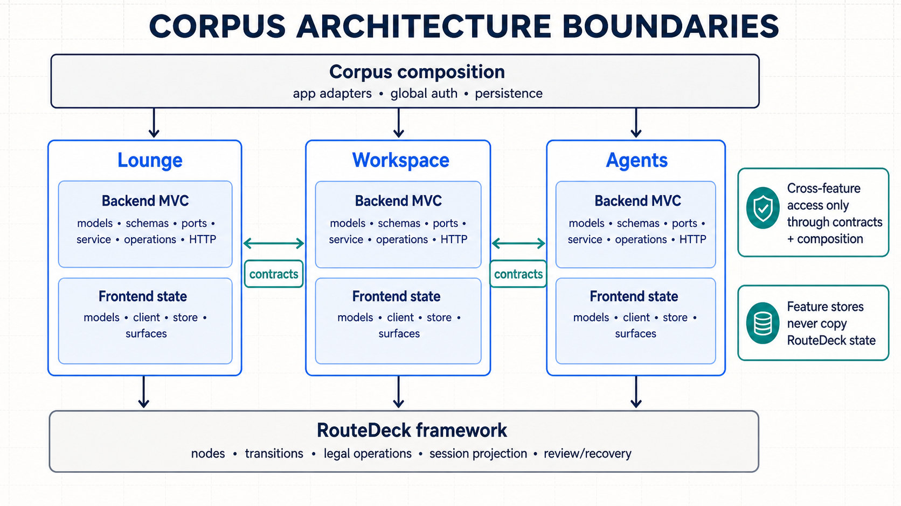

# Corpus Feature Architecture

Corpus is a modular monolith. Each RouteDeck feature owns one vertical product
slice, while application composition, authentication, persistence primitives,
and truly generic contracts remain outside feature packages.



## Feature boundary

A backend feature may contain these roles as its behavior requires:

- `contracts.py`: deliberately public cross-feature references;
- `models.py`: feature-owned persisted or domain truth;
- `schemas.py`: validated request and response serialization;
- `ports.py`: protocols required from another subsystem or external service;
- `service.py`: domain and application rules independent of HTTP and RouteDeck;
- `declarations.py`: RouteDeck Operations and stable identifiers;
- `operations.py`: RouteDeck handlers that call feature services or ports;
- `feature.py`: Nodes, Capabilities, Surfaces, policies, and transitions;
- `bindings.py`: the feature's handler/provider/guard binding factory;
- `http.py`: feature-owned HTTP endpoints when structured data is not a
  RouteDeck projection.

The matching frontend slice uses `models.ts`, `client.ts`, and `store.ts` for
feature domain/query state and actions, plus feature-owned surface components.
RouteDeck store state is never copied into a feature store. RouteDeck continues
to own legal interaction, navigation, pending review, session/projection
versions, and operation recovery.

## Global and shared ownership

- `corpus.composition`, `corpus.bindings`, and `corpus.app` are the composition
  boundary. They may connect concrete subsystems to feature ports.
- `corpus.auth` and `frontend/src/auth` own global identity and owner-session
  state. Lounge uses them but does not own them.
- `corpus.persistence` owns database lifecycle and generic persistence
  primitives. Feature tables and repository behavior remain feature-owned.
- `corpus.shared` and `frontend/src/shared` contain only stable, product-neutral
  primitives. They do not import features.
- Cross-feature navigation is injected by the application composition root.
  A direct cross-feature import is allowed only from the target feature's
  `contracts` module.
- Concrete auth, provider, mail, or persistence adapters never enter a feature
  operation handler through an implicit global. They implement an explicit
  feature port and are wired centrally.

## MVC-style relationship

The model is feature-owned server truth. Schemas serialize its public shape.
Services apply domain rules. RouteDeck Operations and feature HTTP endpoints
are controller boundaries. The frontend feature store consumes the endpoint,
owns loading/error/data state, and exposes actions to surfaces. This mirrors
the useful Django/DRF/MobX relationship without duplicating RouteDeck's state
machine in the browser.

## Mechanical enforcement

Run:

```powershell
.\.venv\Scripts\python.exe scripts\check_architecture_boundaries.py
```

The checker currently governs Lounge, Workspace, and Agents. It rejects
feature-to-application imports, concrete auth imports, cross-feature internal
imports, frontend feature-store coupling, and shared-layer dependencies on
product subsystems. Sources remains outside this enforcement set until its
separate implementation lane is reconciled.
