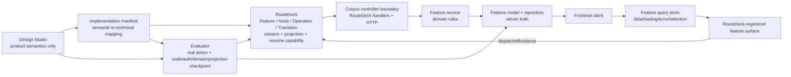

# Implemented Feature Architecture Report

Date: 2026-08-06
Scope: Design Studio -> implementation manifest -> RouteDeck -> Corpus backend/frontend for Lounge, Workspace, and Agents

## Executive result

The implemented core path is real and horizontally complete for:

- public Lounge privacy routing;
- owner registration, sign-out, and sign-in;
- authenticated Workspace overview and entry to Agents;
- owner-scoped Agent inventory and empty state;
- Agent creation with immutable configuration version 1;
- Agent editing as immutable configuration version 2;
- multi-Agent selection, reload persistence, Workspace count, and cross-owner isolation;
- evaluator execution of the actual RouteDeck Operations, node transitions, authentication state, domain state, and projection state.

The architecture follows the intended MVC/Django/DRF/MobX-inspired pattern inside each RouteDeck feature. RouteDeck remains the state-machine owner; feature stores do not copy RouteDeck state.

The release boundary remains partial. Archive, delete, source attachment, rollback, version-history browsing, runnable builds, deployments, and channels are designed-only and are not exposed as working controls.

## Verified feature scope

| Feature | Manifest status | Implemented behaviors | Deliberately not implemented |
| --- | --- | --- | --- |
| Lounge | complete | arrival, product help, registration, sign-in, password recovery/reset, verification resend/confirm | none in the mapped Lounge manifest |
| Workspace | partial | enter Workspace, activity overview, quick actions to Agents/Sources | signed-in general Corpus help, cross-feature task continuation, RouteDeck-owned sign-out behavior mapping |
| Agents | partial | view, create, inspect current configuration, save a new immutable configuration version | attach/create/open source, archive, delete, rollback/history browsing, runnable/deployed lifecycle |

Source: `contracts/corpus-agent-design-routedeck-manifest.json`.

## Architecture flow

### 1. Design Studio boundary

`docs/corpus-agent-design/workbench/design-state.json` owns product meaning: feature guidance, behaviors, policies, capabilities, surfaces, operations, suggested actions, and evaluation definitions. It does not contain compiled RouteDeck IDs.

The Studio now accepts `state` as an evaluation coverage tag and structurally validates the repository-owned saved file. The persisted review values were normalized from the unsupported value `accepted` to the Studio's established `approved` state. A regression test loads the real `design-state.json` through the runtime validator.

### 2. Mapping boundary

`contracts/corpus-agent-design-routedeck-manifest.json` is the only semantic-to-implementation mapping owner. For the implemented Agents slice it maps:

- View agents -> `agents.home` -> `agents.open_create`;
- Create an agent -> `agents.create` -> `agents.create_agent`;
- Inspect an agent -> `agents.home`;
- Edit an agent -> `agents.home` -> `agents.save_changes`.

The same manifest binds evaluator setup adapters, expected outcomes, surfaces, final nodes, authentication, and domain-state checkpoints.

### 3. RouteDeck boundary

Corpus composes Lounge, Workspace, Agents, and Sources in `backend/src/corpus/composition.py`. Feature declarations in `backend/src/corpus/features/agents/feature.py` define `agents.home` and `agents.create`, their legal affordances, and their transitions. `backend/src/corpus/bindings.py` binds handlers, providers, and guards without moving concrete auth into feature logic.

RouteDeck owns:

- legal Operations and transitions;
- current Node and projected Surfaces/SuggestedActions;
- session and projection versions;
- navigation history and opaque resume handles;
- operation supervision and failure/recovery semantics.

The corrected RouteDeck projection invariant advances `projection_version` when session-bound resume-handle inputs change, allowing the frontend to observe a new authoritative URL after a same-node Agent edit.

### 4. Backend MVC-style feature boundary

The Agents backend is a self-contained feature package:

- `models.py`: Agent identity plus immutable `AgentVersion` records;
- `schemas.py`: validated public input/output shapes;
- `ports.py`: repository and owner-scope protocols plus domain conflicts;
- `repository.py`: organization-scoped queries, duplicate-name enforcement, optimistic expected-version check, and next-version insertion;
- `service.py`: list/get/create/update application rules;
- `declarations.py`: stable RouteDeck Operation declarations;
- `operations.py`: controller handlers that call the service;
- `feature.py`: Nodes, Capabilities, Surfaces, policies, affordances, and transitions;
- `bindings.py`: feature binding factory;
- `http.py`: authenticated read endpoints for frontend query state.

Global identity stays in `corpus.auth`; concrete owner resolution is adapted in `backend/src/corpus/app/agents_adapters.py` and wired at the composition root. The feature does not import concrete auth or another feature's internals.

### 5. Frontend mirrored feature boundary

The frontend Agents slice mirrors the useful model/client/store/surface relationship:

- `models.ts`: serialized Agent view/input contracts;
- `client.ts`: authenticated `/api/agents` reads;
- `store.ts`: loading, error, inventory, and selected-Agent query state;
- `AgentsHomeSurface.tsx` and `CreateAgentSurface.tsx`: rendered interaction and RouteDeck affordance dispatch.

`frontend/src/routedeck/surfaces.tsx` is the registration boundary. `frontend/src/app/createRouteDeck.ts` owns the RouteDeck store, route codec, resume-capability validation, and resume bootstrap. The Agent store never duplicates current Node, legal Operations, navigation, session/projection versions, or recovery state.

## Evaluator architecture

The evaluator is no longer chat-only for the implemented behaviors.

1. Studio definitions author a message/action plan ending in a deterministic checkpoint.
2. The manifest maps product-semantic actions to exact RouteDeck Operations and Surfaces.
3. `HttpEvaluationActionRuntime` provisions real owner/session state, invokes actual suggested actions or Surface submissions through RouteDeck, and reads the live projection.
4. Checkpoints compare current Node, authentication, visible Surface/SuggestedAction evidence, session/projection versions, and observed domain state from real Agents and Workspace endpoints.
5. Artifacts retain definition, design, manifest, Corpus-worktree, and RouteDeck-worktree hashes.

Fresh passing evaluator runs:

| Definition | Result artifact |
| --- | --- |
| Agents create -> node `agents.home`, one Agent, version 1, Workspace count 1 | `.runtime/evaluations/20260806T101407Z-9b1592fda4/result.json` |
| Agents edit -> same node, version 2, updated instructions | `.runtime/evaluations/20260806T101421Z-e5ba9ad5d8/result.json` |
| Workspace quick action -> node `agents.home`, authenticated, real zero-Agent state | `.runtime/evaluations/20260806T101434Z-2c630f5ddf/result.json` |
| Registration/sign-in product journey with real mailbox | `.runtime/evaluations/20260806T101501Z-efad728195/result.json` |

## Recorded end-to-end evidence

### Owner, Workspace, and Agents

Run `20260806T154211Z-4c4a6511de` passed 16 assertions with zero HTTP >=400 responses, console errors/warnings, or page errors. In addition to the owner and Agent lifecycle, it proves that signup and sign-in each transition in place without issuing a document request. The four recorded document loads are the initial load, two explicit sign-outs, and the deliberate reload used to prove Agent version persistence. It recorded two organizations, two Agents owned by one organization, and three immutable Agent versions. Aborted long-poll/SSE requests during navigation and page closure are retained as non-blocking diagnostics.

- result: `.runtime/evaluations/20260806T154211Z-4c4a6511de/result.json`
- trace: `.runtime/evaluations/20260806T154211Z-4c4a6511de/browser-trace.zip`
- video: `.runtime/evaluations/20260806T154211Z-4c4a6511de/owner-agents-acceptance.mp4` (54.9 seconds; review-paced)

### Public Lounge privacy boundary

Run `20260806T101847Z-22d110a5c4` passed against the real model, waited for the response stream to finish, and opened the actual Sign-in Surface without exposing Workspace agents.

- result: `.runtime/evaluations/20260806T101847Z-22d110a5c4/result.json`
- trace: `.runtime/evaluations/20260806T101847Z-22d110a5c4/browser-trace.zip`
- video: `.runtime/evaluations/20260806T101847Z-22d110a5c4/public-lounge-boundary.mp4`

### Design Studio

Run `20260806T101347Z-03ed0dc818` passed with no HTTP, console, or page errors. It proves that the saved Studio state loads, Agents exposes nine designed behaviors, and Agent creation has explicit Normal + State evaluation coverage.

- result: `.runtime/evaluations/20260806T101347Z-03ed0dc818/result.json`
- trace: `.runtime/evaluations/20260806T101347Z-03ed0dc818/browser-trace.zip`
- video: `.runtime/evaluations/20260806T101347Z-03ed0dc818/design-studio-walkthrough.mp4`

## Architecture audit findings

### A1 - High: approved Studio stories still report blocking completeness issues

Agents View/Create/Inspect/Edit are persisted as approved, but the live Studio reports blockers; for example, Create an agent shows 10 blockers and its state eval case shows 6 issues with a Stale result. Approval and readiness are therefore not the same enforced gate. Runtime behavior passes, but the design-governance state is not release-clean.

Required follow-up: prevent approval when completeness is blocking, or explicitly reopen and complete the affected stories before re-approval. Then publish a consolidated current eval result that the Studio can recognize.

### A2 - High: Lounge availability guidance is stale

The Lounge product-help guidance in the Studio seed, saved design, and generated backend policy still says the remaining Agent lifecycle is not operational anywhere. Core Agent inventory, creation, inspection, and immutable configuration editing are now operational in a private Workspace.

Required follow-up: correct the product-owned Studio guidance first, then regenerate/update the mapped backend policy and rerun Lounge grounding evaluations.

### A3 - Medium: one post-chat return navigation hit a RouteDeck bootstrap lifecycle race

An earlier retained recording run hit `RouteDeck dispatch requires a live bootstrapped store` when immediately using Back to Lounge after the public chat opened Sign in. The isolated public-only and owner-only acceptance runs both pass, but the combined same-page transition is not proven reliable.

Required follow-up: reproduce that exact post-chat Back-to-Lounge sequence and diagnose the store disposal/bootstrap ordering. Do not treat the separate passing lanes as proof that this race is fixed.

### A4 - Medium: Studio current-result presentation is stale despite fresh passing artifacts

The evaluator artifacts are valid and fresh, but the Studio still labels the Agent create case Stale. Its external evidence view is driven by the current aggregate/latest result and design identity; sequential per-scenario runs can displace each other.

Required follow-up: generate one aggregate result containing the implemented Workspace/Agents definitions, or change the external evidence index to resolve current evidence per definition and identity.

## Mechanical gates

- Design Studio: 35/35 tests passed; TypeScript check and production build passed.
- `scripts/check_architecture_boundaries.py`: passed.
- `scripts/check_agent_design_parity.py`: passed.
- documentation coverage advisory: all changed Studio and recorder files mapped to owning code-map rows.

## Conclusion

The implemented runtime architecture is correctly separated and the core owner/Workspace/Agents product path is proven. The remaining risk is architecture governance drift around Studio readiness/current-evidence status, stale Lounge product truth, and the one combined-page RouteDeck bootstrap race. These should be resolved before declaring the broader Agents lifecycle release-ready.
