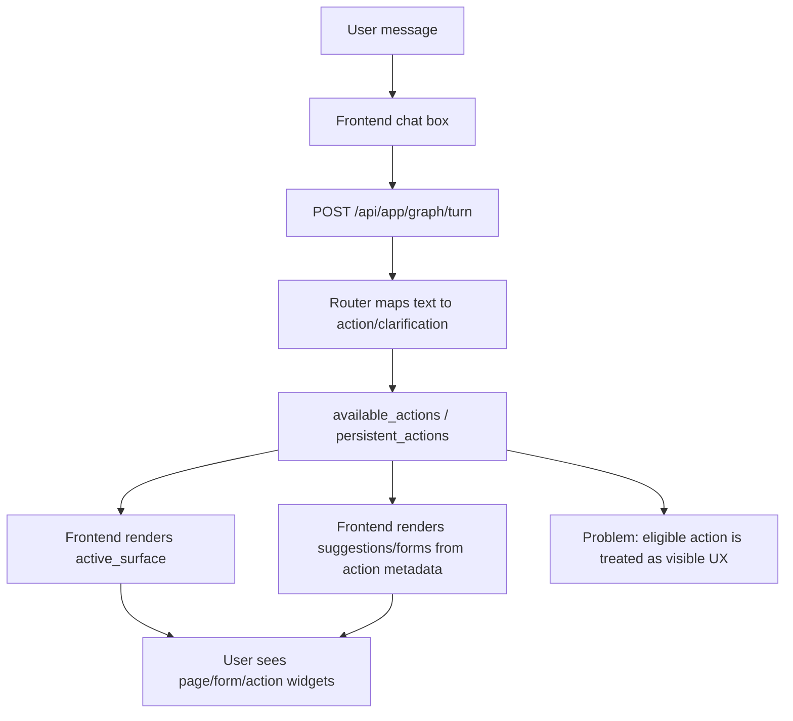
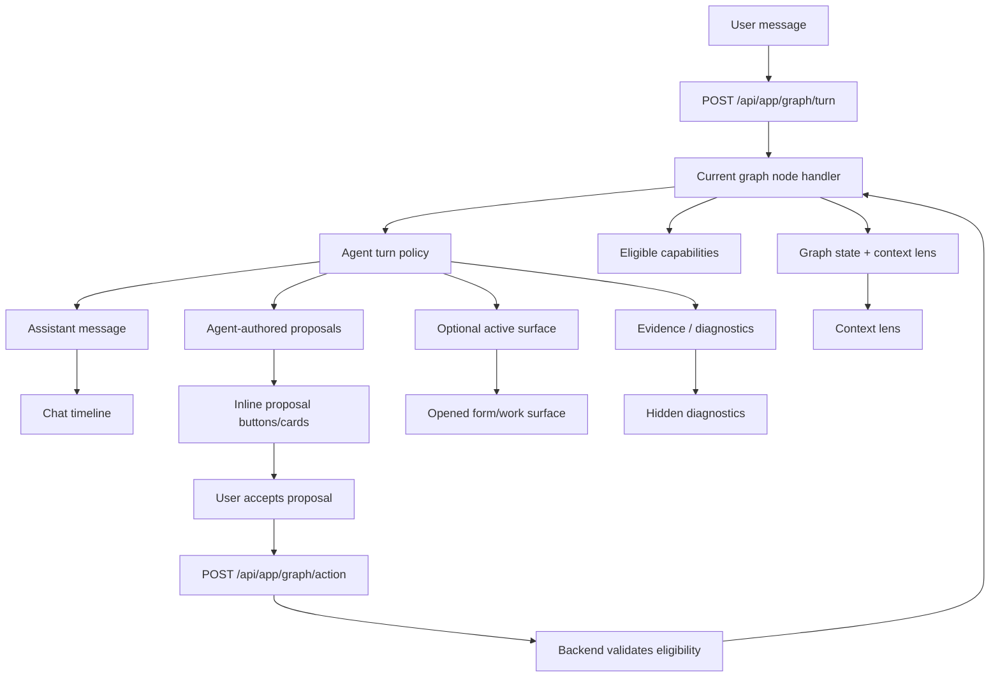

# Context Checkpoint - 17-05-2026 12:14 PM

## Reason For Checkpoint

Session is ending after repeated UX/architecture drift during the graph-first and agent-first RouteDeck reset. This checkpoint captures the current problem and the architecture discussion so the next chat can resume from the corrected framing instead of continuing the flawed implementation direction.

## Current Problem

The current implementation is not cohesive with the product vision. It still behaves like an action router UI with chat decoration:

- Chat is not the actual agent runtime; it is a text box in front of graph/action routing.
- RouteDeck action eligibility is leaking too directly into visible UI.
- `available_actions` and `persistent_actions` are treated as things to render now, instead of internal capabilities the agent may propose.
- Forms can appear because the graph state allows them, not because the user or agent initiated a form lifecycle.
- The `home` state is still behaving like a foyer/page/state-machine entry instead of the opening context inside an agent conversation.
- The no-model/default turn path answers like a router or setup menu, not like an agent.
- Tests passed because they verified technical graph plumbing, not alignment with the agentic UX vision.

## User Vision Restated

The app should open into a central SaaS Agent conversation. The graph is real and authoritative, but it should be invisible as a product metaphor. RouteDeck is the bridge between graph state and frontend transformation, not the visible UX and not a form/action renderer by itself.

The user should experience:

- a central agent conversation
- a clear context lens showing what the agent is working on
- agent-authored proposals, questions, and work surfaces
- forms only after the user accepts/initiates a proposal
- graph/RouteDeck internals only in diagnostics

## Current Architecture



## Target Architecture



## Correct Contract Direction

Replace the current response semantics:

```ts
type CurrentResponse = {
  available_actions: EntryActionCard[]
  persistent_actions: EntryActionCard[]
  active_surface: Surface
}
```

with an agent-turn-oriented contract:

```ts
type AgentTurnResponse = {
  state: GraphState
  context_lens: ContextLens
  message: AssistantMessage
  capabilities: Capability[]      // possible internally, not auto-rendered
  proposals: Proposal[]           // visible, agent-authored next steps
  active_surface?: Surface        // opened only after initiation/acceptance
  evidence: Evidence[]
  diagnostics: Diagnostics        // hidden unless developer opens it
}
```

## Non-Negotiable Rules For Next Session

- Do not continue patching the current UI as-is.
- Do not render forms solely because an action is eligible.
- Do not equate RouteDeck `available_actions` with visible product UX.
- Do not make RouteDeck own LLM calls or API keys.
- Do not expose graph/node/action-id language outside diagnostics.
- Do not treat no-model mode as a menu repeater.
- Start with an architecture/contract reset before more component edits.

## Suggested Next Step

Create an ADR or implementation plan for an `AgentTurnResponse` contract and then refactor:

1. Backend: separate `capabilities` from `proposals`.
2. Backend: make `/turn` the primary agent runtime response path.
3. Backend: make `/action` only handle explicit accepted proposal/form submissions.
4. Frontend: render chat, proposals, optional active surface, context lens, hidden diagnostics.
5. Tests: assert forms do not render until user acceptance; assert generic chat asks/answers conversationally; assert eligible capabilities are not directly visible unless proposed.

